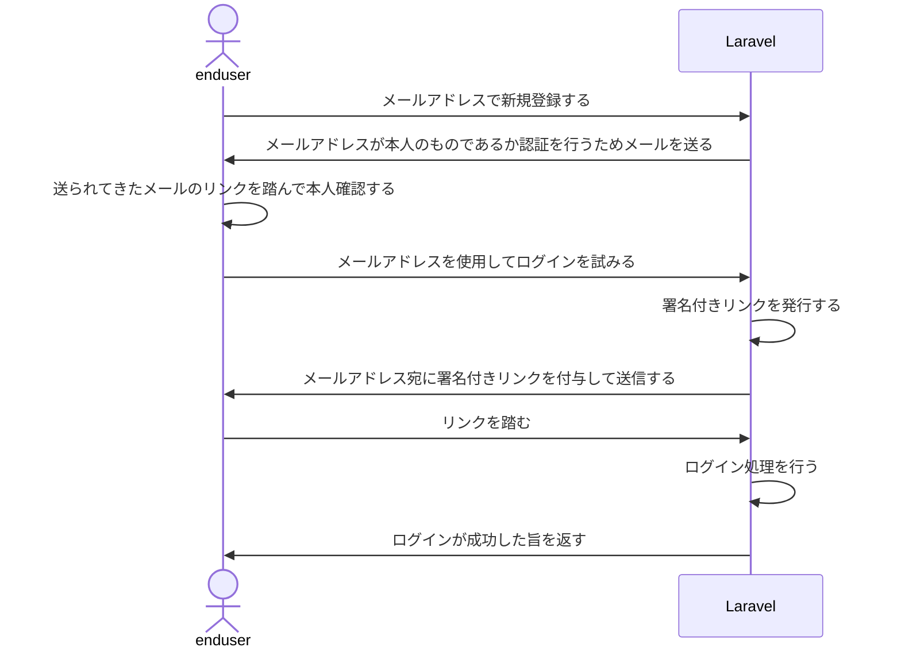

```mermaid
sequenceDiagram
    actor user as enduser
    participant laravel as Laravel

    user->>laravel: メールアドレスで新規登録する
    laravel->>user: メールアドレスが本人のものであるか認証を行うためメールを送る
    user->>user: 送られてきたメールのリンクを踏んで本人確認する
    user->>laravel: メールアドレスを使用してログインを試みる
    laravel->>laravel: 署名付きリンクを発行する
    laravel->>user: メールアドレス宛に署名付きリンクを付与して送信する
    user->>laravel: リンクを踏む
    laravel->>laravel: ログイン処理を行う
    laravel->>user: ログインが成功した旨を返す
```
